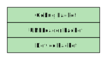

# Gebug64.Unfloader

C# dotnet6 library, port of [UNFLoader](https://github.com/buu342/N64-UNFLoader), modified for use with gebug romhack. This is the PC application side of things.

On the console, the UNFLoader library provides basic communication support from N64 ROM over USB. The attached flashcart device will have its own protocol which UNFLoader automatically manages. The gebug ROM implements another protocol layer on top of UNFLoader. This C# library will parse gebug level messages, as well as understand device specific protocol messages (for supported devices).

See [protocol readme](doc/ProtocolReadme.md) for information about the protocol.



## Supported devices

This library supports:

* Everdrive


## Project structure

The project is organized in the following structure:

```
Gebug64.Unfloader
├── Flashcart: device implementation
├── Message: gebug communication and message processing
│   ├── CommandParameter: message arguments
│   └── MessageType: describes the different supported messages
└── UsbPacket: UNFLoader communication and message processing
. DeviceManager.cs : core communication manager class

```
