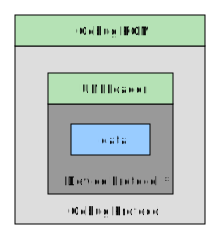

# Gebug Communication

Gebug communication between PC and console is done using a custom protocol. The protocol is designed to efficiently communicate commands from PC to console, and to efficiently communicate a response back to the PC.

A single message from PC to console (or back) is built up in layers. At the lowest layer is the device protocol (e.g. Everdrive). When testing if "In Device Menu", this is the only layer of protocol used. On top of the device layer, is the UNFLoader layer, provided by the UNFLoader `usb.c` source. Finally, on top of the UNFLoader layer is the Gebug layer (UNFLoader + Gebug layer are implemented in custom romhack).  These three layers will compose a single *packet* sent from PC to console (or back). If there is more data than can fit in the single USB buffer (on console) that needs to be transmitted then the *message* will be split into multiple packets.

When a message is received, the PC or console will perform the action described by the command. If required, an `ACK` message will be created to reply. Not all commands will generate an `ACK` response.

Protocol layers:



# Gebug Protocol

All Gebug *packets* begin with a 12 byte header, followed by optional header data, followed by the body/parameter value(s). All *packets* within a *message* share the same 12 byte header. A *message* consists of one or more packets.

Required header data:

| Byte(s) | Title | Description |
| -------- | ------- | ------- |
| 0 | Category | Message category, what kind of command will be executed. |
| 1 | Command | The specific command to be executed within the category. |
| 2-3 | Flags | (see below) |
| 4-5 | Remaining packet size | Count of the number of bytes from offset 6 to the end of the packet inclusive. |
| 6-7 | Number parameters | The number of parameters specified in the body/bodies of the message. |
| 8-9 | Message Id | Id for this message. Should be pseudo-unique or sequential. |
| 10-11 | ACK Id | If this is a response packet, this field will contain the `Message Id` of the message being responded to. Otherwise the contents of this field are ignored. |

Flags:

* `0x1`: Indicates a multi-packet message. The optional header values for `Packet Number` and `Total Packets` must be included (see below).
* `0x2`: Reply message. `ACK Id` value must be set.
* `0x4` - `0x8000`: reserved.

Optional header data:

| Byte(s) | Title | Description |
| -------- | ------- | ------- |
| 12-13 | Packet Number | Indicates the packet number in a multi-packet message. Count starts at 1. Included when flag mutli-packet is set. |
| 14-15 | Total Packets | The total number of packets in a multi-packet message. Minimum value is 1. Included when flag mutli-packet is set. |


## Parameter Values

After the header data, the remaining packet content will consist of the parameter values, if any. Some messages do not contain parameters (e.g., ping reply), so the body will be empty.

Each Category+Command will define relevant parameters; this is not communicated by the protocol, but defined below. See the `Category` section.

For 1, 2, and 4 byte values, this will be included in the packet in sequential order. For parameters consisting of more than 4 bytes a "length" prefix is included before the byte data.

The length prefix consists of an "escape" value, followed by the number of bytes in the parameter.

| Escape | Length | Length Size |
| -------- | ------- | ------- |
| `0xff` | less than 2^8 | 1 byte |
| `0xfe` | less than 2^16 | 2 byte |
| `0xfd` | less than 2^32 | 4 byte |

When building a message, the body (parameter values) of a message are computed first. If the total length (header + body) is longer than can fit in a single packet, then the message will be a multi-packet message. The body content is simply split across packets according to the max allowed packet size (the length prefix is only included once).

Properties of size 1, 2, and 4 byte values are considered "native" and endieness considerations should apply. Otherwise the property will be considered a byte array as above.


## Endieness

All `short`/`ushort` (16 bit) and `int`/`uint` (32 bit) values in a Gebug *packet* are in Big Endien format.

## Performance Note

In reality, the protocol has a bit of room to improve efficiency. However, much of the communication "cost" comes from the slow USB connection speed (on Everdrive). Increasing the USB buffer to, say, 2048 bytes would decrease transfer speed of 3MB by 1-2 sec (this would use fewer packets, therefore fewer packet header bytes). But the transfer would still take just over 10 seconds due to slow throughput. Therefore I decided it's worth the cost of a slightly more verbose protocol.

## Common type info

```
struct RmonBasicPosition {
    // 24 bit stan id, with 8 bit room id
    // on console: (stanid & 0x00FFFFFF) | ((u32)roomid << 24)
    u32 packed_stanid; 

    struct coord3d pos;
};
```

-----

# Category, Command, and Parameters

Following is a listing of the defined *categories*, and the *commands* in each *category*. Associated with each *command* are the *parameters*. These will be listed in the sequential order they are expected within the packet.

Each *parameter* will have a `UseDirection` associated with it.

`UseDirection`:

* `PcToConsole`: Parameter is only used when sending a command from PC to console (i.e., "source").  
* `ConsoleToPc`: Parameter is only used when sending a command from console to PC (i.e., "reply").  
* `Both`: Parameter is used in both directions.  

## Categories

The message categories are defined as follows

```
public enum GebugMessageCategory
{
    DefaultUnknown = 0,

    Ramrom = 10,
    Replay = 15,
    SaveState = 20,
    Debug = 25,
    Objectives = 30,
    Cheat = 35,
    Memory = 40,
    Sound = 45,
    Fog = 50,
    Stage = 55,
    Bond = 60,
    Chr = 65,
    Objects = 70,
    File = 75,
    Vi = 80,
    Meta = 90,
    Misc = 95,
}
```

## `Ramrom` Category

The `Ramrom` category is for the native demo replay and recording methods in the game.

`Ramrom` commands are as follows

```
public enum GebugCmdRamrom
{
    DefaultUnknown = 0,

    StartDemoReplayFromPc = 10,
    ReplayRequestNextIteration = 12,
    ReplayFromExpansionPak = 13,
    ReplayNativeDemo = 30,
}
```

### `Ramrom StartDemoReplayFromPc` Command

Packet contains `struct ramromfilestructure` header data, will load and start replay.

**Reply**: No.

| Parameter No. | Name          | Size (bytes) | UseDirection  | Description   |
| ------------- | ------------- | ------------ | ------------- | ------------- |
|  1            | Header        |  variable    | `PcToConsole` | Byte array of `struct ramromfilestructure` |


### `Ramrom ReplayRequestNextIteration` Command

Console request for next iteration of ramrom replay blocks.

**Reply**: Yes.

| Parameter No. | Name          | Size (bytes) | UseDirection  | Description   |
| ------------- | ------------- | ------------ | ------------- | ------------- |
|  1            | ReplayId        |  2  (u16)    | `ConsoleToPc` | MessageId of original request to load demo from PC. |
|  2            | IterationIndex        |  2  (u16)    | `ConsoleToPc` | Index of the iteration data being requested (starts at zero). |
|  3            | IterationData        |  variable    | `PcToConsole` | Replay iteration data for the single request iteration. |

### `Ramrom ReplayFromExpansionPak` Command

Transfer replay to expansion pak memory, then start ramrom replay. PC should first check if xpak is installed.

**Reply**: No.

| Parameter No. | Name          | Size (bytes) | UseDirection  | Description   |
| ------------- | ------------- | ------------ | ------------- | ------------- |
|  1            | Data        |  variable    | `PcToConsole` | Ramrom replay. Should contain file contents of `struct ramromfilestructure` with all iteration data. |

### `Ramrom ReplayNativeDemo` Command

Request to start a replay demo from the native `ramrom_table` list.

**Reply**: No.

| Parameter No. | Name          | Size (bytes) | UseDirection  | Description   |
| ------------- | ------------- | ------------ | ------------- | ------------- |
|  1            | Index        |  1    | `PcToConsole` | Which replay demo to start. |


## `Debug` Category

The `Debug` category is for executing debug methods still in the retail version of the game.

`Debug` commands are as follows

```
public enum GebugCmdDebug
{
    DefaultUnknown = 0,

    ShowDebugMenu = 1,
    DebugMenuProcessor = 99,
}
```

### `Debug ShowDebugMenu` Command

Sets `g_BossIsDebugMenuOpen` to the value of the parameter. Note that in order for the debug menu to be interactive, you must be holding C UP and C DOWN when the value is changed.

**Reply**: No.

| Parameter No. | Name          | Size (bytes) | UseDirection  | Description   |
| ------------- | ------------- | ------------ | ------------- | ------------- |
|  1            | Open      |  1           | `PcToConsole` | Set `g_BossIsDebugMenuOpen` to value. |


### `Debug DebugMenuProcessor` Command

Calls `debug_menu_case_processer` with the supplied value. Note: This method was added to the gebug ROM. This is the switch statement found in `debug_menu_processor`, but extracted to its own method. The parameter supplied is the value passed to the switch statement.

**Reply**: No.

| Parameter No. | Name          | Size (bytes) | UseDirection  | Description   |
| ------------- | ------------- | ------------ | ------------- | ------------- |
|  1            | MenuCommand   |  1           | `PcToConsole` | Debug switch value. |

## `Cheat` Category

The `Cheat` category is for native cheat methods. This includes toggling runtime cheats, as well as all of the unlock methods, which are programmed as "cheats".

`Cheat` commands are as follows

```
public enum GebugCmdCheat
{
    DefaultUnknown = 0,

    SetCheatStatus = 10,
    DisableAll = 12,
}
```

### `Cheat SetCheatStatus` Command

Turns a cheat on or off. Note that turning off an "unlock" cheat does nothing.

**Reply**: No.

| Parameter No. | Name          | Size (bytes) | UseDirection  | Description   |
| ------------- | ------------- | ------------ | ------------- | ------------- |
|  1            | Enable      |  1           | `PcToConsole` | 0 "turns off" cheat, a non zero value enables the cheat. |
|  2            | CheatId      |  1           | `PcToConsole` | cheat id. ROM enum type is `CHEAT_ID`, the C# equivalent is `CheatIdX` |


### `Cheat DisableAll` Command

Disables all runtime cheats. This is a meta method, added to the rom to disable all cheats.

**Reply**: No.

| Parameter No. | Name          | Size (bytes) | UseDirection  | Description   |
| ------------- | ------------- | ------------ | ------------- | ------------- |
|  N/A          | N/A           |  N/A         | N/A           | N/A           |

## `Stage` Category

The `Stage` category is for changing or loading the current stage.

`Stage` commands are as follows

```
public enum GebugCmdStage
{
    DefaultUnknown = 0,

    SetStage = 10,
    NotifyLevelSelected = 13,
    NotifyLevelLoaded = 14,
}
```

### `Stage SetStage` Command

Sets `g_MainStageNum` to the supplied value. Currently only supports single player, so size is one byte.

**Reply**: No.

| Parameter No. | Name          | Size (bytes) | UseDirection  | Description   |
| ------------- | ------------- | ------------ | ------------- | ------------- |
|  1            | LevelId       |  1           | `PcToConsole` | ROM enum type is `LEVEL_ID`, the C# equivalent is `LevelIdX`. |


### `Stage NotifyLevelSelected` Command

Send notice from console to pc that a stage has been selected. Multiplayer stage requires two bytes.

**Reply**: No.

| Parameter No. | Name          | Size (bytes) | UseDirection  | Description   |
| ------------- | ------------- | ------------ | ------------- | ------------- |
|  1            | LevelId       |  2           | `ConsoleToPc` | ROM enum type is `LEVEL_ID`, the C# equivalent is `LevelIdX`. |


### `Stage NotifyLevelLoaded` Command

Send notice from console to pc that a stage is being loaded. Multiplayer stage requires two bytes.

**Reply**: No.

| Parameter No. | Name          | Size (bytes) | UseDirection  | Description   |
| ------------- | ------------- | ------------ | ------------- | ------------- |
|  1            | LevelId       |  2           | `ConsoleToPc` | ROM enum type is `LEVEL_ID`, the C# equivalent is `LevelIdX`. |

## `Bond` Category

`Bond` category is for managing / viewing data related to Bond.

`Bond` commands are as follows

```
public enum GebugCmdBond
{
    DefaultUnknown = 0,

    SendPosition = 14,
    TeleportToPosition = 17,
}
```

### `Bond SendPosition` Command

Read Bond stan, room, position, and rotation from console and send to pc.

**Reply**: No.

| Parameter No. | Name          | Size (bytes) | UseDirection  | Description   |
| ------------- | ------------- | ------------ | ------------- | ------------- |
|  1            | PackedStanId  |  4           | `ConsoleToPc` | Bond's current stan (internal name/id), and room. |
|  2            | PosX          |  4           | `ConsoleToPc` | X value from `bondviewGetCurrentPlayersPosition()`. |
|  3            | PosY          |  4           | `ConsoleToPc` | Y value from `bondviewGetCurrentPlayersPosition()`. |
|  4            | PosZ          |  4           | `ConsoleToPc` | Z value from `bondviewGetCurrentPlayersPosition()`. |
|  5            | VVTheta       |  4           | `ConsoleToPc` | `g_CurrentPlayer->vv_theta` or zero. |

### `Bond TeleportToPosition` Command

Teleport Bond to position.

**Reply**: No.

| Parameter No. | Name          | Size (bytes) | UseDirection  | Description   |
| ------------- | ------------- | ------------ | ------------- | ------------- |
|  1            | PosX          |  4           | `ConsoleToPc` | 32 bit float, target x position. |
|  2            | PosZ          |  4           | `ConsoleToPc` | 32 bit float, target z position. |
|  3            | StanId        |  4           | `ConsoleToPc` | Stan "name" id, which is only 24 bits, but sent as 32 bits. |


## `Chr` Category

`Chr` category is for managing / viewing data related to guards and other characters.

`Chr` commands are as follows

```
public enum GebugCmdChr
{
    DefaultUnknown = 0,

    SendAllGuardInfo = 10,
    NotifyChrSpawn = 14,
    GhostHp = 21,
    MaxHp = 22,
}
```

### `Chr SendAllGuardInfo` Command

Send all position information for all current/loaded characters (chr with a non-null model).

`GuardInfo` is an array of the following type:
```
struct RmonGuardInfo {
    s16 chrnum; // chr num (from setup)
    u8 chrslot_index; // index into runtime list of guards
    s8 actiontype; // ACT_TYPE
    struct coord3d prop_pos;
    struct coord3d target_pos;
    f32 subroty;
    f32 damage;
    f32 maxdamage;
    f32 shotbondsum;
    u32 anim; // untranslated animation address
    CHRFLAG chrflags;//s32
    u8 prop_flags;
    u8 chr_flags2;
    u16 chr_hidden;
};
```

**Reply**: No.

| Parameter No. | Name          | Size (bytes) | UseDirection  | Description   |
| ------------- | ------------- | ------------ | ------------- | ------------- |
|  1            | Count         |  2           | `ConsoleToPc` | Number of items in chr list. |
|  2            | GuardInfo     |  variable    | `ConsoleToPc` | List of all guard position data. |


### `Chr NotifyChrSpawn` Command

Sends all character spawn positions for this tick from console to pc.

`Data` is an array of the following type (see "Common type info" above):
```
struct RmonMsgSingleChrSpawn {
    struct RmonBasicPosition bpos;
};
```

**Reply**: No.

| Parameter No. | Name          | Size (bytes) | UseDirection  | Description   |
| ------------- | ------------- | ------------ | ------------- | ------------- |
|  1            | Count         |  2           | `ConsoleToPc` | Number of character spawns. |
|  2            | Data          |  variable    | `ConsoleToPc` | List of position data. |


### `Chr GhostHp` Command

Remove all body armor and all but 0.01 HP from guard.

**Reply**: No.

| Parameter No. | Name          | Size (bytes) | UseDirection  | Description   |
| ------------- | ------------- | ------------ | ------------- | ------------- |
|  1            | ChrNum        |  2           | `ConsoleToPc` | In-game chrnum id. |
|  2            | ChrSlotIndex  |  1           | `ConsoleToPc` | Index source from g_ChrSlots. |


### `Chr MaxHp` Command

Set guard HP to zero. This removes any current body armor.

**Reply**: No.

| Parameter No. | Name          | Size (bytes) | UseDirection  | Description   |
| ------------- | ------------- | ------------ | ------------- | ------------- |
|  1            | ChrNum        |  2           | `ConsoleToPc` | In-game chrnum id. |
|  2            | ChrSlotIndex  |  1           | `ConsoleToPc` | Index source from g_ChrSlots. |


## `Objects` Category

`Objects` category is for managing / viewing data related to setup objects.

`Objects` commands are as follows

```
public enum GebugCmdObjects
{
    DefaultUnknown = 0,

    NotifyExplosionCreate = 4,
}
```

### `Objects NotifyExplosionCreate` Command

Sends notification from console to pc for all explosions created this tick.

`Data` is an array of the following type (see "Common type info" above):
```
struct RmonMsgSingleExplosionCreate {
    s16 explosion_type;
    s16 unused;
    struct RmonBasicPosition bpos;
};
```

**Reply**: No.

| Parameter No. | Name          | Size (bytes) | UseDirection  | Description   |
| ------------- | ------------- | ------------ | ------------- | ------------- |
|  1            | Count         |  2           | `ConsoleToPc` | Number of explosions created. |
|  2            | Data          |  variable    | `ConsoleToPc` | List of position data. |


## `File` Category

`File` category is for methods in file.c and file2.c.

`File` commands are as follows

```
public enum GebugCmdBond
{
    DefaultUnknown = 0,

    UnlockStageDifficulty = 10,
}
```

### `File UnlockStageDifficulty` Command

Pass through to call `fileUnlockStageInFolderAtDifficulty`.

**Reply**: No.

| Parameter No. | Name          | Size (bytes) | UseDirection  | Description   |
| ------------- | ------------- | ------------ | ------------- | ------------- |
|  1            | Stage         |  1           | `PcToConsole` | enum LEVEL_SOLO_SEQUENCE |
|  2            | Difficulty    |  1           | `PcToConsole` | enum DIFFICULTY |


## `Vi` Category

The `Vi` category handles video related methods such as found in `fr.c`, `vi.c`, `viewport.c`, etc.

`Vi` commands are as follows

```
public enum GebugCmdVi
{
    DefaultUnknown = 0,

    GrabFramebuffer = 10,
    SetZRange = 22,
    SetViewSize = 24,
    SetViewPosition = 26,
}
```

### `Vi GrabFramebuffer` Command

Dumps the framebuffer back to PC. There are a couple different ways to go about this, the native indy command accessed `g_ViBackData->framebuf` and `cfb_16`, but I couldn't achieve good results with that. The gebug ROM instead reads from `g_ViFrontData->framebuf` which still occasionally has tearing/artifacts.

**Reply**: Yes.


| Parameter No. | Name          | Size (bytes) | UseDirection  | Description   |
| ------------- | ------------- | ------------ | ------------- | ------------- |
|  1            | Width         |  2           | `ConsoleToPc` | result from `viGetX()` |
|  2            | Height        |  2           | `ConsoleToPc` | result from `viGetY()` |
|  3            | Data          |  variable    | `ConsoleToPc` | Contains `2 * viGetX() * viGetY()` bytes, as read from `g_ViFrontData->framebuf`. Data should be processed 16 bits at a time, read as N64 native 5551 RGBA format. |

### `Vi SetZRange` Command

Call native `void viSetZRange(f32 near, f32 far)`.

**Reply**: No.

| Parameter No. | Name          | Size (bytes) | UseDirection  | Description   |
| ------------- | ------------- | ------------ | ------------- | ------------- |
|  1            | Near          |  4    (f32)  | `PcToConsole` | Near parameter |
|  2            | Far           |  4    (f32)  | `PcToConsole` | Far parameter |


### `Vi SetViewSize` Command

Call native `void viSetViewSize(s16 x, s16 y)`.

**Reply**: No.

| Parameter No. | Name          | Size (bytes) | UseDirection  | Description   |
| ------------- | ------------- | ------------ | ------------- | ------------- |
|  1            | Width         |  2    (s16)  | `PcToConsole` | Width parameter |
|  2            | Height        |  2    (s16)  | `PcToConsole` | Height parameter |


### `Vi SetViewPosition` Command

Call native `void viSetViewPosition(s16 left, s16 top)`.

**Reply**: No.

| Parameter No. | Name          | Size (bytes) | UseDirection  | Description   |
| ------------- | ------------- | ------------ | ------------- | ------------- |
|  1            | Left          |  2    (s16)  | `PcToConsole` | Left parameter |
|  2            | Top           |  2    (s16)  | `PcToConsole` | Top parameter |

## `Meta` Category

The `Meta` consists of commands about the rom, and about the protocol itself.

`Meta` commands are as follows

```
public enum GebugCmdMeta
{
    DefaultUnknown = 0,

    ConfigEcho = 1,
    Ping = 2,
    Version = 10,
}
```

### `Meta Ping` Command

Sends a simple ping command.

**Reply**: Yes.

| Parameter No. | Name          | Size (bytes) | UseDirection  | Description   |
| ------------- | ------------- | ------------ | ------------- | ------------- |
|  N/A          | N/A           |  N/A         | N/A           | N/A           |

### `Meta Version` Command

Version information about the ROM running on console. This is 4 words describing the version as `1.2.3.4`.

**Reply**: Yes.

| Parameter No. | Name          | Size (bytes) | UseDirection  | Description   |
| ------------- | ------------- | ------------ | ------------- | ------------- |
|  1            | VersionA      |  4           | `ConsoleToPc` | Version word 1 |
|  2            | VersionB      |  4           | `ConsoleToPc` | Version word 2 |
|  3            | VersionC      |  4           | `ConsoleToPc` | Version word 3 |
|  4            | VersionD      |  4           | `ConsoleToPc` | Version word 4 |
|  5            | Size          |  4 (u32)     | `ConsoleToPc` | Size in bytes of available memory |


## `Misc` Category

The `Misc` category is for single commands that don't fit into other categories.

`Misc` commands are as follows

```
public enum GebugCmdMisc
{
    DefaultUnknown = 0,

    OsTime = 1,
    OsMemSize = 2,
}
```

### `Misc OsTime` Command

Requests current ROM OS time.

**Reply**: Yes.

| Parameter No. | Name          | Size (bytes) | UseDirection  | Description   |
| ------------- | ------------- | ------------ | ------------- | ------------- |
|  1            | Count      |  4           | `ConsoleToPc` | `osGetCount()` |


### `Misc OsMemSize` Command

Requests available memory size.

**Reply**: Yes.

| Parameter No. | Name          | Size (bytes) | UseDirection  | Description   |
| ------------- | ------------- | ------------ | ------------- | ------------- |
|  1            | Size          |  4 (u32)     | `ConsoleToPc` | `osGetMemSize()` |
