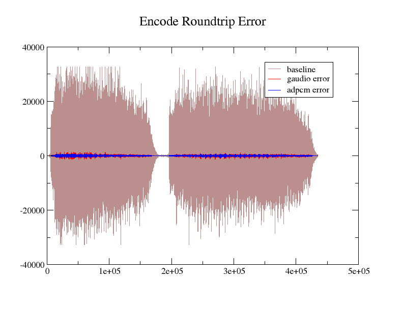
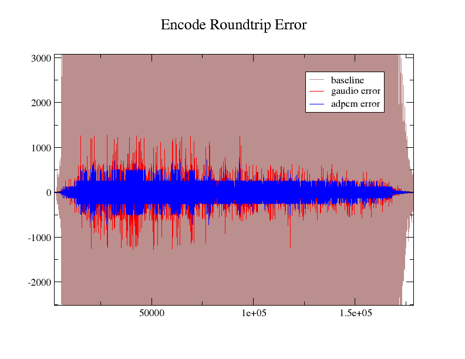
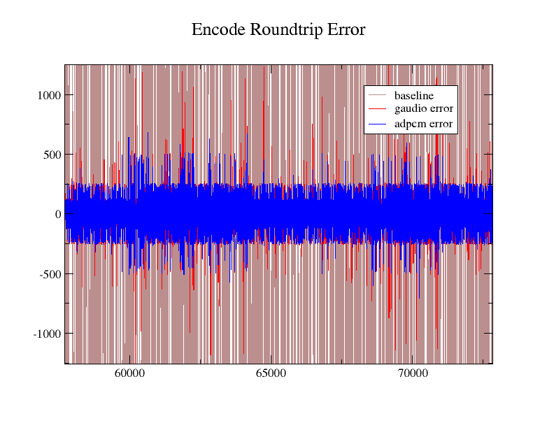
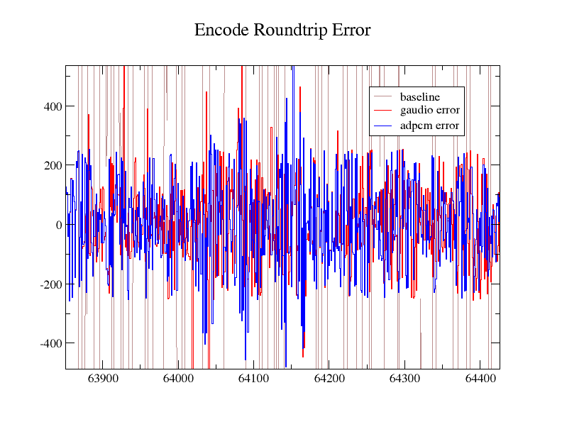
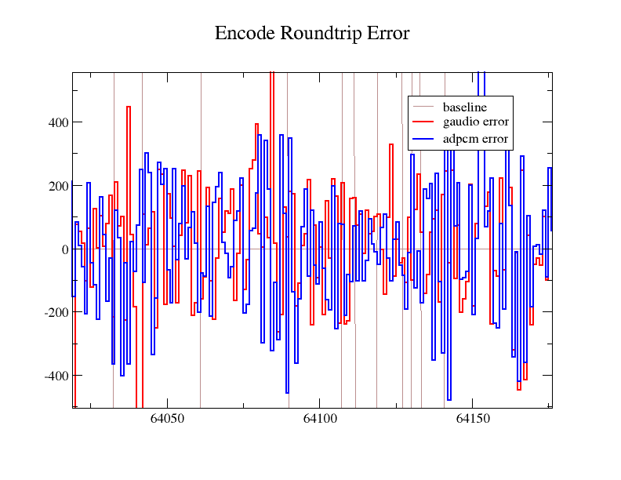
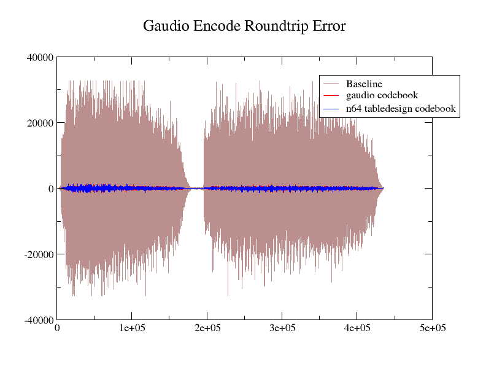
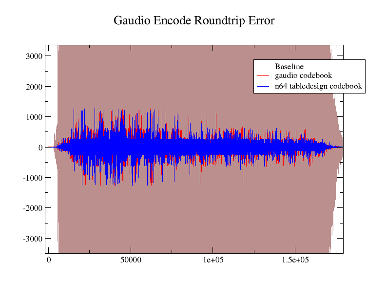
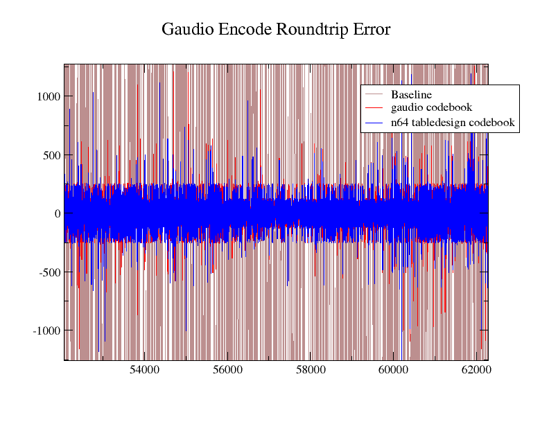
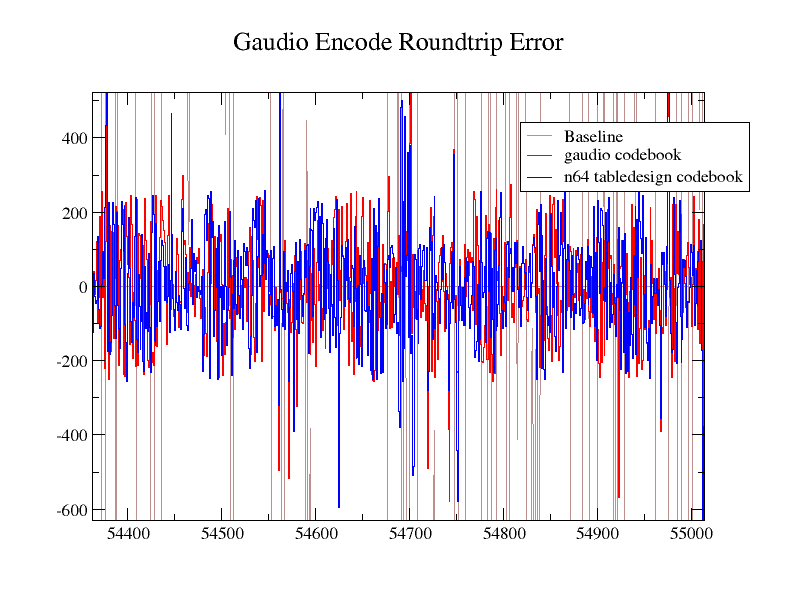
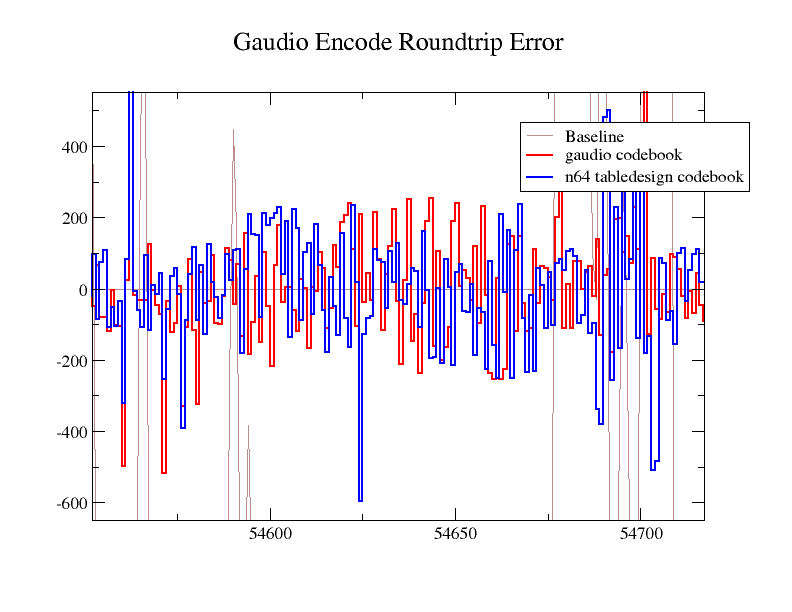

# Test #1: round trip error: gaudio vs adpcm

## Method:
Start with 16 bit mono wav file. Encode to aifc format, then decode. Compare against original wav.

The wav audio data will be copied into a aiff file and byte swapped for adpcm.

Comparison method will be to evaluate each 16-sample against original file. The sum of square differences will be collected.

The n64 tabledesign program was used to generate the codebook used by both programs.

```
2
2
  1190    258    747    312    502    290    354    245
   444   1286    536    863    499    610    422    446
 -1694  -2959  -3764  -4124  -4087  -3724  -3121  -2368
  3576   4549   4985   4940   4501   3772   2862   1876
```

The adpcm tool will encode to aifc, but decodes raw audio samples. Audacity was used to convert the raw audio to wav format.

The sample used is the first track from "Good News for People Who Love Bad News". No audio loops are used.

## Commands used:

```
vadpcm_enc_native -c test_horn.codebook Horn.aiff test01.aifc
vadpcm_dec_native test01.aifc > test01.raw

wav2aifc --debug --in=test_data/Horn.wav --coef=test_data/Horn-gaudio.coef
aifc2wav --debug --in=test_data/Horn.aifc --out=test_data/test01.wav
```

## WavDiff program:

A simple C# program was written to tally sample differences. This skips a set number of bytes to the sound data, then reads 16-bit samples and computes the difference against the original file. Samples are read from all three files (baseline, gaudio, adpcm) until one of the three files is out of samples.

## WavDiff Results:

For baseline `x`, gaudio version `A`, adpcm version `B`

```
skipBytes: 44
bytes read: 870,240
samples read: 435,120

Sum of |x - A|:        29,689,627
Sum of (|x - A|^2): 4,277,527,225
Sum of |x - B|:        30,972,956
Sum of (|x - B|^2): 4,282,157,636
Sum of |B - A|:        33,714,273
Sum of (|B - A|^2): 69,96,764,063
```

Comparison images


Figure 1.1

Figure 1.2

Figure 1.3

Figure 1.4

Figure 1.5


## Test 1 Conclusions:
Guadio encode roundtrip sum of squares error is slightly better than the adpcm tool. This is surprising because Figure 1.2 seems to indicate the error is worse. This seems to imply that overall gaudio has slightly more accurate encoding in general, but where it does differ from adpcm, the errors are slightly larger. Subjectively, there is no noticeable difference in sound quality between the baseline audio, or either roundtrip audio file.


-----

# Test #2: codebook comparison

## Method:
A wav file will be encoded to aifc then back to wav using gaudio. The same comparison method will be used as the previous test.

The first version (A) to be compared will use the codebook generated from gaudio tabledesign:

```
order=2;
npredictors=2;
book=
  -176,   -176,   -162,   -148,   -135,   -123,   -112,   -102,
  2058,   1892,   1725,   1571,   1430,   1303,   1186,   1080,
 -1667,  -2875,  -3602,  -3872,  -3747,  -3312,  -2662,  -1896,
  3532,   4425,   4758,   4605,   4069,   3271,   2330,   1356;
```

The second version (B) will be round trip encode using the codebook from the previous test (generated with n64 tabledesign).

## Commands used:
```
bin/tabledesign --debug --in=test_data/Horn.wav --out=test_data/Horn-gaudio.coef --predictors=2

wav2aifc --debug --in=test_data/Horn.wav --coef=test_data/Horn-gaudio.coef
aifc2wav --debug --in=test_data/Horn.aifc --out=test_data/test02.wav
```

## Encode error:
The wav2aifc tool will output encode error on verbose or debug level output. The first value, "g_square_error" is the sum of square error from the first phase of encoding (codebook selector phase, aka model error). This is only measured if there is more than one predictor. The other output parameter, "g_quantize_error" is sum of square error measured from quantize step of encoding.

## Encode error results:

```
gaudio encode roundtrip, gaudio codebook:
g_square_error:   1.42173e+12
g_quantize_error: 3.26190e+04

gaudio encode roundtrip, n64 tabledesign codebook:
g_square_error:   3.84990e+12
g_quantize_error: 3.19220e+04
```

## WavDiff Results:

For baseline `x`, gaudio codebook version `A`, n64 tabledesign codebook version `B`

```
skipBytes: 44
bytes read: 870,240
samples read: 435,120

Sum of |x - A|:        29,978,588
Sum of (|x - A|^2): 4,332,052,384
Sum of |x - B|:        29,689,627
Sum of (|x - B|^2): 4,277,527,225
Sum of |B - A|:        38,975,837
Sum of (|B - A|^2): 7,563,240,871
```

Comparison images


Figure 2.1

Figure 2.2

Figure 2.3

Figure 2.4

Figure 2.5

## Test 2 Conclusions:
The encode model error is slightly better for gaudio codebook, however the quantize error is improved when using the n64 tabledesign codebook. The wavdiff comparisons indicate the n64 tabledesign codebook is slightly superior. Visual inspection of the charts seems to indicate the error differences are approximately the same scale, unlike the previous test. Subjectively, there is no noticeable difference in sound quality between the baseline audio, or either roundtrip audio file.

-----

## Overall Conclusions

Overall, gaudio compares favorably to adpcm and tabledesign tools. There are differences in number and kind for errors introduced by encoding, but the output is comparable.


--------------------------------------------

Appendix A:
C# program to compare wav samples

```
static void Main(string[] args)
{

    string baselinePath = "baseline.wav";
    string versionAPath = "versiona.wav";
    string versionBPath = "versionb.wav";

    string baselineSamplesOutputPath = "baselineSamples.csv";
    string versionASamplesOutputPath = "versionASamples.csv";
    string versionBSamplesOutputPath = "versionBSamples.csv";
    string versionADiffOutputPath = "versionADiff.csv";
    string versionBDiffOutputPath = "versionBDiff.csv";

    // note: headers were the same in all files for all tests
    int skipBytes = 44;
    int readLength;
    int pos;

    var baselineBytes = System.IO.File.ReadAllBytes(baselinePath);
    var versionABytes = System.IO.File.ReadAllBytes(versionAPath);
    var versionBBytes = System.IO.File.ReadAllBytes(versionBPath);

    int baselineByteLength = baselineBytes.Length;
    int versionAByteLength = versionABytes.Length;
    int versionBByteLength = versionBBytes.Length;

    readLength = baselineByteLength - skipBytes;
    if (versionAByteLength - skipBytes < readLength)
    {
        readLength = versionAByteLength - skipBytes;
    }
    if (versionBByteLength - skipBytes < readLength)
    {
        readLength = versionBByteLength - skipBytes;
    }

    if ((readLength & 0x01) == 1)
    {
        readLength--;
    }

    int sampleCount = readLength / 2;
    int samplePos = 0;

    baselineBytes = baselineBytes.Skip(skipBytes).Take(readLength).ToArray();
    versionABytes = versionABytes.Skip(skipBytes).Take(readLength).ToArray();
    versionBBytes = versionBBytes.Skip(skipBytes).Take(readLength).ToArray();

    var baselineSamples = new Int16[sampleCount];
    var versionASamples = new Int16[sampleCount];
    var versionBSamples = new Int16[sampleCount];

    var versionADiff = new int[sampleCount];
    var versionBDiff = new int[sampleCount];
    var abdelta = new int[sampleCount];

    Int64 versionADiffAbsSum = 0;
    Int64 versionADiffAbsSquareSum = 0;
    Int64 versionBDiffAbsSum = 0;
    Int64 versionBDiffAbsSquareSum = 0;
    Int64 abdeltaAbsSum = 0;
    Int64 abdeltaAbsSquareSum = 0;
    int temp;

    pos = 0;
    for (samplePos = 0; samplePos < sampleCount; samplePos++)
    {
        baselineSamples[samplePos] = baselineBytes[pos];
        versionASamples[samplePos] = versionABytes[pos];
        versionBSamples[samplePos] = versionBBytes[pos];

        pos++;

        baselineSamples[samplePos] |= (Int16)((uint)baselineBytes[pos] << 8);
        versionASamples[samplePos] |= (Int16)((uint)versionABytes[pos] << 8);
        versionBSamples[samplePos] |= (Int16)((uint)versionBBytes[pos] << 8);

        pos++;

        versionADiff[samplePos] = baselineSamples[samplePos] - versionASamples[samplePos];
        versionBDiff[samplePos] = baselineSamples[samplePos] - versionBSamples[samplePos];
        abdelta[samplePos] = versionASamples[samplePos] - versionBSamples[samplePos];

        temp = Math.Abs(versionADiff[samplePos]);
        versionADiffAbsSum += temp;
        versionADiffAbsSquareSum += temp * temp;

        temp = Math.Abs(versionBDiff[samplePos]);
        versionBDiffAbsSum += temp;
        versionBDiffAbsSquareSum += temp * temp;

        temp = Math.Abs(abdelta[samplePos]);
        abdeltaAbsSum += temp;
        abdeltaAbsSquareSum += temp * temp;
    }

    using (FileStream fs = File.Open(baselineSamplesOutputPath, FileMode.OpenOrCreate, FileAccess.Write, FileShare.None))
    {
        string fileContents = String.Join("\n", baselineSamples.Select((x, i) => $"{i} {x}"));
        Byte[] info = System.Text.Encoding.ASCII.GetBytes(fileContents);
        fs.Write(info, 0, info.Length);
    }

    using (FileStream fs = File.Open(versionASamplesOutputPath, FileMode.OpenOrCreate, FileAccess.Write, FileShare.None))
    {
        string fileContents = String.Join("\n", versionASamples.Select((x, i) => $"{i} {x}"));
        Byte[] info = System.Text.Encoding.ASCII.GetBytes(fileContents);
        fs.Write(info, 0, info.Length);
    }

    using (FileStream fs = File.Open(versionBSamplesOutputPath, FileMode.OpenOrCreate, FileAccess.Write, FileShare.None))
    {
        string fileContents = String.Join("\n", versionBSamples.Select((x, i) => $"{i} {x}"));
        Byte[] info = System.Text.Encoding.ASCII.GetBytes(fileContents);
        fs.Write(info, 0, info.Length);
    }

    using (FileStream fs = File.Open(versionADiffOutputPath, FileMode.OpenOrCreate, FileAccess.Write, FileShare.None))
    {
        string fileContents = String.Join("\n", versionADiff.Select((x, i) => $"{i} {x}"));
        Byte[] info = System.Text.Encoding.ASCII.GetBytes(fileContents);
        fs.Write(info, 0, info.Length);
    }

    using (FileStream fs = File.Open(versionBDiffOutputPath, FileMode.OpenOrCreate, FileAccess.Write, FileShare.None))
    {
        string fileContents = String.Join("\n", versionBDiff.Select((x, i) => $"{i} {x}"));
        Byte[] info = System.Text.Encoding.ASCII.GetBytes(fileContents);
        fs.Write(info, 0, info.Length);
    }

    Console.WriteLine(string.Empty);
    Console.WriteLine($"skipBytes: {skipBytes}");
    Console.WriteLine($"readLength: {readLength}");
    Console.WriteLine($"sampleCount: {sampleCount}");
    Console.WriteLine(string.Empty);
    Console.WriteLine($"versionADiffAbsSum: {versionADiffAbsSum}");
    Console.WriteLine($"versionADiffAbsSquareSum: {versionADiffAbsSquareSum}");
    Console.WriteLine($"versionBDiffAbsSum: {versionBDiffAbsSum}");
    Console.WriteLine($"versionBDiffAbsSquareSum: {versionBDiffAbsSquareSum}");
    Console.WriteLine($"abdeltaAbsSum: {abdeltaAbsSum}");
    Console.WriteLine($"abdeltaAbsSquareSum: {abdeltaAbsSquareSum}");
    Console.WriteLine(string.Empty);
}
```
