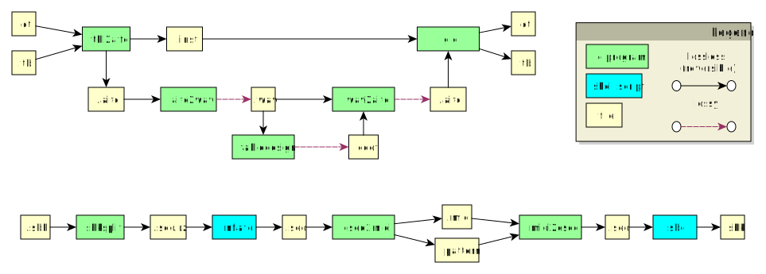

# Gaudio Technical Documentation

## Conversion Lifecycle

The following file format conversions are supported by gaudio.

Converting to MIDI and back to soundbank is fully reversible. Converting from .ctl/.tbl to .aifc+.inst is fully reversible. Converting from .aifc to .wav is not.

## AIFC File Format

The .aifc file is AIFF format with custom compression.

There are four supported chunk types:

- "FORM": root chunk
- "SSND": sound chunk
- "APPL": application specific chunk
- "COMM": audio information chunk

Non supported chunks should be ignored by gaudio.

The application specific chunk supports two subtypes:

- "VADPCMCODES": Codebook specification
- "VADPCMLOOPS": Sample loop information

There are two supported compression types:

- "VAPC": Standard compression format (`AL_ADPCM_WAVE` type)
- "NONE": No compression used (`AL_RAW16_WAVE` type)

## WAV File Format

There are four supported chunk types:

- "RIFF": root chunk
- "fmt ": format chunk
- "data": track data
- "smpl": loop information

Only 16-bit mono PCM wav files are supported.

## SEQ File Format

Gaudio generally refers to the N64 compressed MIDI format as sequence format, and uses .seq extension. This is based on the MIDI format.

There are no Note Off events, only Note On.

Note On event has been changed, a variable length integer is appended specifying the duration of the note in ticks.

Tempo event removed the length byte (`0x03`).

End of track event does not include trailing `0x00` byte now.

A loop start event has been added, consisting of four bytes. `0xff`, followed by `0x2e`. The next byte is the loop number. The last byte is `0xff`.

A loop end event has been added, consisting of eight bytes. `0xff`, followed by `0x2d`. The next byte is a loop count, and the following byte is current loop count. The next four bytes are a big endian value giving the offset to the loop start. This offset is measured from the end of the loop end event to the end of the loop start event (the Programming Manual gives a different definition).

Loop offsets are calculated **after** pattern substitution!

The programming manual states a loop count of zero will loop forever, but the game does not honor this, so max loop values should be used.

Gaudio assumes that MIDI running status is supported only for non-system events and non-meta events.

### Pattern Markers

Sequence files can contain pattern substitution. This is a four byte sequence referring to a position earlier in the file that should be copied over this four byte marker. This begins with `0xfe`. The next two bytes are a big endian offset from the end of the pattern marker to the start of the byte sequence that should be copied (max of `0xfdff`). The last byte is the length in bytes that should be copied (max of `0xff`).

Regular byte `0xfe` not associated to a pattern marker should be escaped with a second `0xfe`.

Patterns are unrolled against a snapshot of the track. (Do not unroll in place).

Patterns can refer to byte sequences in a previous track.

Pattern markers cannot be nested. Gaudio assumes that no pattern can ever contain a system event or meta event (or at least the bytes `0xff`, `0xfe`).

Loop offsets are calculated **after** pattern substitution!

## MIDI File Format

Gaudio only supports a limited number of MIDI events; these are the events supported by the in-game sequence player. Any non-supported events must be removed before gaudio can process the file.

Supported events:

- Note On
- Note Off
- Polyphonic Pressure
- Control Change
- Program Change
- Channel Pressure
- Pitch Bend
- End Of Track
- Meta command: Tempo
- System Exclusive gaudio event

Note: the in-game sequence player only supports a subset of Control Change values, but gaudio does not enforce this.

Gaudio assumes that MIDI running status is supported only for non-system events and non-meta events.

See Programming Manual section 20.5 or `midi.h` for more information on MIDI events.

### MIDI Loop Event

The Programming Manual section 20.5 states that loop events are encoded as MIDI Control Change events. These are as follows:

- Controller 102: loop start, value is loop number  
- Controller 103: loop end, value is loop number
- Controller 104: loop count (0-127), value is loop count
- Controller 105: loop count (128-255), value is loop count

Gaudio will automatically convert between the above MIDI loop events and seq loop events, for valid loop definitions.

### MIDI Gaudio System Exclusive Event

There are many instances of invalid loop events in the retail version of the game. These are difficult or impossible to fully reverse from MIDI back to sequence format since some required information is missing. Therefore, invalid loop events are not exported from the sequence files by default.

If you choose to export invalid loop events, gaudio will wrap the invalid sequence loop events in a MIDI System Exclusive event when converting to MIDI. This may cause playback issues on media player software. Note: this is tested to work in Renoise, and Presonus Studio One. This is known to cause problems with Windows Media Player.
